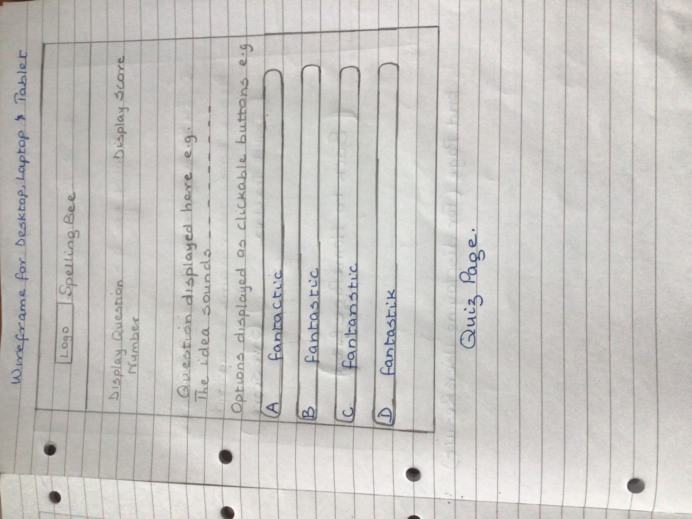
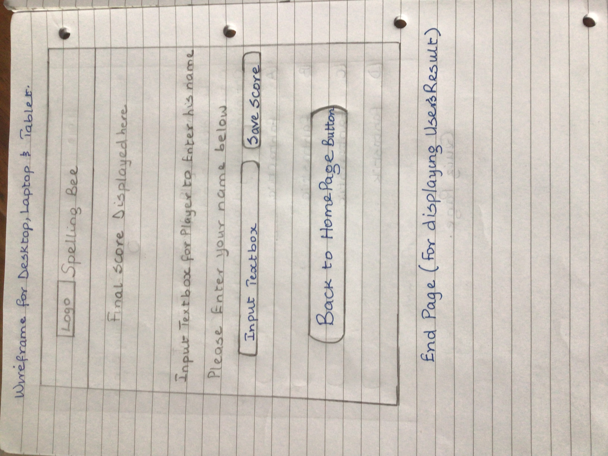
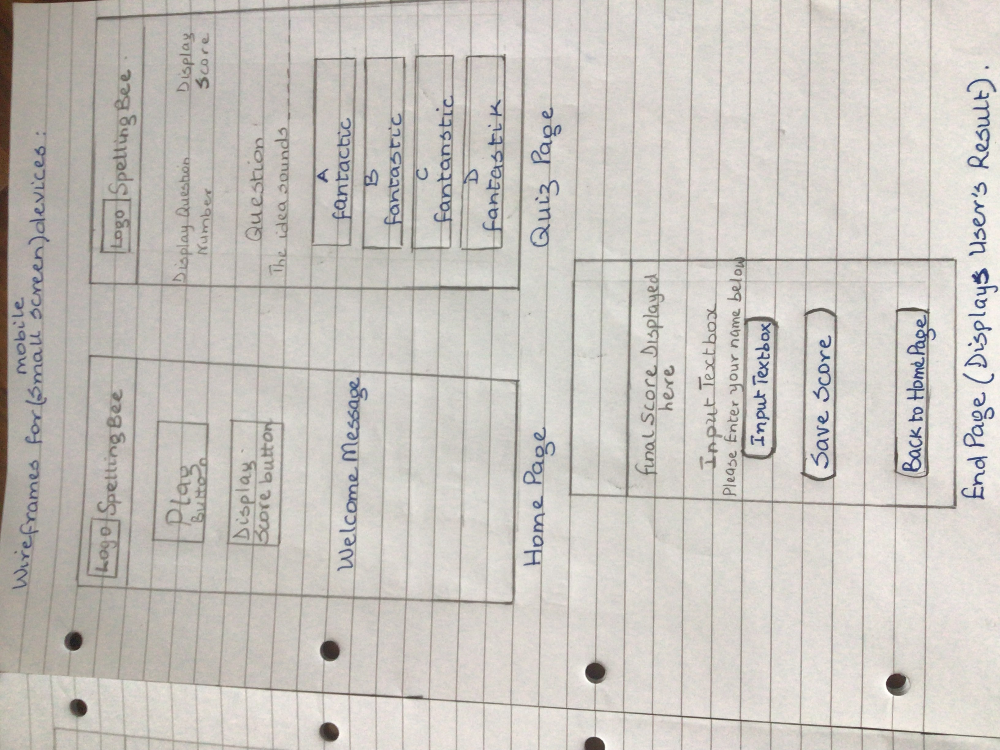

&nbsp; 

# Spelling Bee

Spelling Bee is an online Quiz game that aims at building users vocabulary in order to improve their ability to spell English words.  Users will learn a lot through play since it is a fun game that cuts across all ages, which means that it can be played and enjoyed by all to test how much of their vocabulary they know and if they can spell the words and write them down correctly in order to make a complete sentence. Sometimes, even simple words in English language that we pronounce and use everyday can throw someone off balance when it comes to spelling and writing them down correctly especially for CV and cover letter preparation, formal letter or any where that first impression matters and one's spelling has to be top-notch to prevent your CV from being shoved aside by potential employers due to poor spelling mistakes. 

&nbsp;

# Features

It is designed to be responsive on all device sizes and thereby accessible on a range of devices. Usability was thought of from the start so the user interface was designed in its simplest form with good colour contrast between the background and text colours respectively. The font-size and weight of the texts are large and bold with all texts aligned to the centre so that it can be easily tweaked/adjusted to fit different screen sizes using the "@media screen css rule".  Also, the buttons for navigating around and for submission are big enough to see.  All these features will ensure that both first time and returning users/visitors to the site find it easy to read the texts, navigate around the interface pretty quickly, interact with the game and have a pleasurable experience while doing so. 

## Existing Features

* Heading Bar

    * It is uniform across all the three pages and consists of the logo and Spelling Bee quiz name nicely placed beside each other and aligned to the centre to keep in line with the overall structure of the page.

    * See the 'Heading Bar' Screenshot below:

    

 &nbsp; 

    The entire user interface is divided into three parts namely:

      i. Home Page

      ii. Quiz Page

      iii. End Page (Score Display Area) 

* Home Page 

    * This is the page that appears as a user clicks on the url link and lands on the page. It is defined from the rest the of the screen page by a black border with a heading bar at the top. It welcomes the user and aims at making them feel relaxed and tune them in to a playful fun mode while at the same time learning through their interaction with the quiz app. It consists of two buttons located at the top centre of the page which are the 'play' (the user clicks this to play the quiz) and 'high score' (the user clicks this and it displays thir score) buttons and also a welcome message nicely positioned at the centre of the page.
    For mobile view, most of these features on this page will stack on top of each other for great user experience and responsiveness.

&nbsp; 

* Quiz Page

    * This is the page that the user interacts with in orer to play the quiz. Like the home page, it is defined from the rest the of the screen page by a black border with a heading bar at the top in order to keep in line with uniformity across all  three pages. It consists of 10 questions with each having four options to choose their answer from. Each of the options are displayed inside a button with a default background colour of blue. If a user gets the answer right, the button colour changes to green and a "pat-in-the-back" message pops up to congratulate and spur them to do more and if a user misses the answer, the button colour changes to red and a message pops up to tell them they missed and tell them they can do better.
    A user's score is displayed at the top right hand corner of the page while question number tracker is displayed at the top left corner of the page to let the user know which question they are on.
    The feedback message pops up underneath the score and question tracker area and is nicely centred so it can be clearly seen by the user as they play along.
    For mobile view, most of these features on this page will stack on top of each other for great user experience and responsiveness.

    * See the 'Quiz Page' Screenshot below:

    

 &nbsp; 

* End Page (Score Display Area)       

    * This is the page that the user is directed to at the end of the quiz game. Like the other pages, it is defined from the rest the of the screen page by a black border with a heading bar at the top in order to keep in line with the uniformity already established with other pages. The overall score is displayed at the top centre of the page and a text input box is also provided to allow the user fill in their names for onward use. 
    Finally, the "Back to Home Page" button is displayed at the bottom of the page that redirects the user back to the home page if they wish to play again.
    For mobile view, most of these features on this page will stack on top of each other for great user experience and responsiveness.
    
    * See the 'End Page' Screenshot below:

    

 &nbsp; 

How the Quiz Game works (Use Cases):

 It is a multiple choice question whereby a set of ten questions are provided to the user one after the other in which each is an uncomplete sentence and the job of the user is to fill in each of the blank spaces with the correct word (answer), checking out the options provided carefully before selecting their choice as they look the same to trick the user into picking the wrong answer.  It informs the user at the bottom of the Quiz screen the number of questions he got right and the ones missed by updating its content as the user goes through the ten questions.
 At the end of the quiz, it gives a final verdict in the following way:

 a. If a user scores between 7 and 10 inclusive, it congratulates him by displaying an alert that says "Congratulations ${username}, that was  fantastic!" ( ${username} is a placeholder for the system to fill in each user's name).  
 b. If a user scores between 4 and 6 inclusive, it tells the user he's tried by displaying an alert that says "Well-done ${username} but there is room for improvement!".  
 c. If a user scores between 0 and 3 inclusive, it tells the user he's failed by displaying an alert that says "Oops you failed ${username}, please try again!". 
 
&nbsp; 

User Experience (UX)

* User stories

    * First Time Visitor Goals

        a) I want to easily understand the main purpose of the site and navigate easily around it.
        very intuitive and easy to figure out how to

        b) I want to be able to submit my answer and get response quickly on whether I'm right or wrong.

        c) I want to be able to know how many I got right and the ones I missed with the correct answer displayed.

        
    * Returning Visitor Goals

        a) I want to be able to find relevant information about the opening hours, entry fee etc. to see if there are any changes.

        b) I want to find the best way to get in contact with the tourist centre with any questions or feedbacks I may have.

        c) I want to be able to connect to their social media links to provide feedback and get up to date information about upcoming events.

    * Design

        * Colour Scheme

            * Background colour of a lighter shade of purple was used with a black border. It blends well into the font colour of black which is predominantly used for texts on every page and grey background colour for the buttons.

        *  Typography

            * Google's 'Raleway' and 'Nova Square' typeface was repeatedly used on every page of this website but with variations in sizes and font weights. Lora is a well-balanced contemporary serif and it is a text typeface with moderate contrast well suited for body text. The source is: url('https://fonts.googleapis.com/css2?family=Lora&display=swap'). This font is one of the most common and frequently used web safe fonts in HTML and most browsers recognise it.

        * Imagery

            * Imagery is important. The large image of the Olumo Rock is used to capture the users imagination and attract them to visit the tourist centre.  It is designed to take up almost the full width of the 'Home' Page to make it striking and catch the user's attention.  Also, the Gallery Page consists of a wide range of pictures for users to view and be inspired for a visit and also enjoy.

# Wireframes

 For prototyping, the wireframes were designed manually by hand without using any automated tool in order to bring this idea to life. The screenshots of all the three pages the quiz will have namely home, quiz and end pages   and its look on mobile devices can be viewed below:

    
    
    
    

&nbsp;      

# Technologies Used

* Languages Used

    * HTML5

    * CSS3

&nbsp; 

* Tools Used

    * uizard wireframe for prototyping all the four pages of the website.

    * snipping tool to capture screenshots of validator results, website pages and images used in the README file.

* Issues Encountered and Resolved

    * Mastering and referencing the file paths correctly in my html code and readme file was a bit daunting and confusing at the start but with the help of my cohort facilitator and knowledge gained during the masterclass session, I got over it and everything went on smoothly.

    * While using the terminal, the $ prompt disappeared so I got stuck on how to exit and return back to the promt and this threw me off balance for a while but after doing an online google search, I found the command to use (i.e press q) which was a relief and within a short while, I was back on track.

Frameworks, Libraries and Programs Used

1. Google Fonts

    * Google Font was used to import the 'Lora' font into the style.css file using "@import" statement with the font's url and then used on all pages throughout the website creation but in different styles and sizes. It is then referred to through the use of "font-family" property before it can be effected on any HTML element.

2. Git

    * Git was used for version control by utilising the Gitpod terminal to commit to Git and push to GitHub.

3. GitHub

    * GitHub was used to store the project's code after being pushed from Git.

4. JPEG Compressor

    * JPEG Compressor was used to resize images used on this website.

5. Wix Logo Maker

    * Wix logo maker was used to create the website's logo called christYmet.

6. uizard wireframe

    * uizard was used to create the wireframes used during the design process.

## Testing

The W3C Markup Validator and W3C CSS Validator services were used to validate every page of the project to ensure there were no syntax errors in the project and prettier code formatter was used to format the code for proper code indentation.

*  W3C Markup Validator 

    * Home Page Result:

     

    * History of Olumo Rock Page Result:

     

    * Gallery Page Result:

     

    * Contact Us Page Result:

     

* W3C CSS Validator

    * style.css Result Result:

     

Testing User Stories from User Experience (UX) Section

* First Time Visitor Goals

    i. As a First Time Visitor, I want to easily understand the main purpose of the site and learn more about the history that surrounds the existence of the rock.

        a. Users are automatically greeted with a clean and easily readable navigation bar to take them to any page of their choice.

        b. Users are presented with a large image of the Olumo Rock which covers the entire width of the page and its aim is to make the user's imagination run wild and attract them to come visit.

        c. Users are given a short introduction of the site and an in-depth history of the rock.

        d. The 'Gallery' page displays various images of the rock taken at different views and their historical importance. It also contains pictures of tourists/visitors to the centre.

        e. Information about the opening times and entry fee are displayed clearly on the home page for every visitor and most especially first time visitors to see.

    ii. As a First Time Visitor, I want to be able to navigate easily throughout the site to find content.

        a. The site was built with flexibility in mind.  This means that width percentages that allows the site to scale up and down easily across different screen sizes and devices were used.

        b. The site was made never to entrap the user.  There is a clean navigation bar at the top of each page and each of the links clearly describes what page the users will end up at when it is clicked.

        c. There is a "Back to top of the Page" button at the bottom of each page so users can easily get back to the top of the page when at the bottom instead of using the scroll bar which can be frustrating to the user.

        d. There is a Google Map link in the "Contact Page" that gives direction to users on how to locate the centre for first time visitors.

    iii. As a First Time Visitor, I want to lok for testimonials to understand what their users think of them and also want to locate their social media links to see their following on social media to determine how trusted and known they are.

        a. The user can scroll to the bottom of any page on the site to locate social media links in the footer.

        b. On the "Contact Us" page, additional ways of getting in touch are provided there. 

* Returning Visitor Goal  

    i. As a Returning Visitor, I want to find out if any important information such as opening hours, enrty fee, parking availability, direction details etc. has been updated.

        a. The user can easily find the information needed on the appropriate page since they are displayed clearly with meaningful headings and captions in order to avoid ambiguity which can lead to confusion or misinformation. 

        b. In addition, the user can go to the 'Contact Us' page to get the tourism board's contact details such as office address, phone number and email address or drop a query in the Query/Feedback section of the page.

    ii. As a Returning Visitor, I want to find the best way to get in touch with the tourist center management on any enquiry or feedback I may have.

        a. The user can make use of the 'Contact Us' link on the navigation bar which can be found at the top of each page for easy access and is clearly highlighted in lime green when the mouse is hovered on it.

        b. When a user clicks on the 'Contact Us' link, it takes him to the contact us page where the contact details of the tourism board i.e christYmet and an enquiry/feedback form are provided so he can choose which one to reach them on. 

        c. The Contact Us page contains the office address, email address and Phone number of the tourism board.
        
        d. The email address is set up to automatically open up the site's email and auto-fill their e-mail address in the "To" section.

    iii. As a Returning Visitor, I want to connect to the site's social media platforms in order to give feedbacks and get up-to-date information about any upcoming events.

        a. The footer section which can be found on every page contains links to the site's social media platforms represented with each social media platform's logo/icon for easy recognition.

        b. Any link that the user clicks will open in a new tab beside this current website for closer proximity in case they need to switch from one tab to the other and to ensure that they are not taken away completely from this website but can get back easily when necessary.

        c. An external link to the Ogun State Government website is provided in the mid-section of the home page where users can find information about the social media platforms for all the various departments under it in which christYmet History Website is one of them.

*  Further Testing

    * The website was tested on Google chrome, Microsoft Edge, Opera and Mozilla firefox browsers for compatibility. 
    
    * Testing was done to ensure that all pages were linked correctly.

    * The website was viewed on a variety of devices such as desktop, laptop, iPad Pro, iPhone 6s and Huawei P smart Z android phone.

    * Friends and family members were asked to review the site and documentation in order to point out any bugs and/or User eXperience (UX) issues. 

# Deployment

* The Project was deployed to GitHub Pages using the following steps:

    * Log in to GitHub and under the "Repositories" section, click on the "test-your-english-quiz" repository to deploy.

    * At the top right of this repository, click on "Settings".

    * Scroll down the "Settings" page to locate the "GitHub Pages" section.

    * Under the "GitHub Pages" section, click on the "check it out here!" link.

    * From the drop-down menu under "Source" section, select the Master Branch and click on the "Save" button.

    * The Page will automatically refresh and then provide the link/url of the deployed project. 
    
    * Right-click on that link and select "Open link in new tab", it will present the live website in a new tab.

View the live project [here](https://eb0ny-april14.github.io/rockhistory/)

View the GitHub Repository [here](https://github.com/Eb0nY-April14/rockhistory)

&nbsp; 

* Credits

    * Content

        * The Home Page was created by me.

        * The Quiz page was also created by me but with the help of an online tutorial video I watched from Youtube by Brian Design, putting my own twist to it in order to make it different from the author's finished quiz game app.  The styling and JavaScript code has few similarities and major   differences to show that I clearly understood what the author was doing and applied it my own way to the quiz game.   The link to the video tutorial is https://www.youtube.com/watch?v=f4fB9Xg2JEY

    * Media

        * The Logo used for this website was found through Google Search and obtained at https://image.winudf.com/v2/image1/b3JnLmNhbWJyaWRnZWVuZ2xpc2guYnJhdmkucXVpel9pY29uXzE1NTQ5NjExNjRfMDI4/icon.png?w=&fakeurl=1

        * The audio sounds used on the quiz page and how to apply it to my JavaScript file was obtained from this link: https://docs.idew.org/code-trivia-app/advanced/code-mod-examples/sound-add-sound-effects-on-answer-clicks.

        * The font awesome play icon was used on the home page and obtained from the font awesome website while the emojis used on the quiz page for the feedback messages and its corresponding usage tutorial were obtained from the following websites: 

            * https://www.kirupa.com/html5/emoji.htm

            * https://emojipedia.org/

&nbsp; 

* Acknowledgements

    * Cohort Facilitator Kasia for her continuous help and support.

    * My mentor Asandeep for continuous guidance and feedback.

    * W3Schools Website for helpful resources especially with the Gallery Page.

&nbsp; 

# Olumo Rock History

This website was created for the purpose of providing useful information about the Olumo Rock Tourist Centre to both first time and returning visitors ranging from tourists, students, researchers of history and potential investors alike about the famous Olumo Rock located in Abeokuta, the South Western part of Nigeria in West Africa. 

It is an history website created for christYmet, a subsidiary department under the Ogun State Tourism Board in Nigeria.

The aim of the product owner which is christYmet, is to assist the government in its effort to open up the state for tourism and attract visitors to the Olumo Rock in order to make it a tourist hub within Africa and the world at large thereby providing jobs for the locals which results into economy boost and icrease in revenue generation for the state.  It also aims at preserving the cultural heritage of the Yoruba tribe in South West Nigeria for both the present and future generations.

&nbsp;

# Features

It is designed to be responsive on all device sizes and accessible on a range of devices thereby making it easy to navigate through and find useful and relevant content.

## Existing Features

* Navigation Bar

    * It appears on all four pages and is identical across the pages to allow for easy navigation. The full responsive navigation bar consists of the organisation's Logo positioned to the left and the links to the Home Page, "History of Olumo Rock" Page, Gallery Page and the "Contact Us" Page are placed towards the mid-right section of the navigation bar.  

    * The links on the navigation bar are connected together across all pages to allow the user to navigate easily from page to page across all devices without having to go back to the previous page via the 'back' button.

    * See the 'Navigation Bar' Screenshot below:

    

 &nbsp; 

* The Home Page Image

    * The home page has an image of the Olumo Rock with a caption of "Olumo Rock" boldly written on it.

    * The image of the rock is boldly positioned there to capture the users attention and make them long for a visit to the rock.

    

    &nbsp; 

    * Welcome Section

        * The home page has an introduction section called 'Welcome' that welcomes the user to the site. It also gives a brief explanation about the site, the rock and the history surrounding it.

        * See the 'Welcome' Section Screenshot below:

        

        &nbsp; 

    * Opening Hours & Entry Fee Section

        * This section keeps the user informed about the opening hours and entry fee which is a vital information especially for first time visitors and also returning visitors to monitor changes to opening hours or entry fee since they last visited. This information is vital in the sense that it will help them in planning well ahead of their journey whenever they choose to visit. 

        * See the 'Opening Hours & Entry Fee' Section Screenshot below:

        

    * Video Section

        * There is an embedded video about Olumo Rock which captures what visitors will enjoy when they visit the centre. The video was taken from YouTube and embedded into the home page using the <iframe> tag. 

        See the 'Video' Section Screenshot below:

        

         &nbsp; 

    * Direction and Further Enquiries Section

         * In this section, a user is presented with two external links which are Google Map and Ogun State Government Tourism board website and can access them by the use of the 'Click Me' buttons provided on the page. When any of the buttons is clicked, it will either take them to Google Map site where the location and direction to the tourist centre is, and they can use that as a guide to finding the centre or the State tourism board site for further enquiries.

         * See the 'Direction and Further Enquiries' Section Screenshot below:

        

    &nbsp; 

    * The Footer Section

        * The footer section includes links to the relevant social media platforms for christYmet History website where users can get plugged in to get access to up-to-date information and interact with both the site's administrators and fellow users alike. These social media links will open in a new tab so it doesn't interfere with the current page the user is on and allow for easy navigation on the website.

        * The footer is very useful to the user as it encourages them to keep connected via social media.

        * See the 'Footer' Section Screenshot below:

        

&nbsp; 

* History of Olumo Rock Page

    * This Page gives a detailed history about the rock and provides facts and figures too. It explained the significance of the rock, the hunter who discovered it, the purpose it served during the 19th century war, its location and size.

    * See the 'History of Olumo Rock' Page Screenshot below:

    
     

&nbsp; 

* Gallery Page

    * This page contains a gallery of pictures. It shows different views of the rock, other side attractions such as the heritage museum, the african version of the 'ludo' game known as 'ayo' which is close to the 'mancala' board game , pictures of visitors and a whole lot more of activities for visitors delight and enjoyment.

     * See the 'Gallery' Page Screenshot below:

    
    
    
    
    
    

&nbsp; 

* Contact Us Page

    * This page consists of two sections: the 'Contact Details' and the 'Query/Feedback' form section.  The Contact Details section provides the Phone number, Office and Email address of the website owner christYmet so that users who may need it can access it easily.
    The Query/Feedback section is an HTML form that allow users to send their queries and/or give feedbacks so that the website owner can use this information to further improve on the services being provided. 
    At the moment, when a user fills the form and hits the submit button, there's no system in place at the backend to process the data submitted by the user so since there is no implementation for that yet and to forestall the system from throwing a 405 error, the form was made to reset itself instead. It is hoped that the backend will be implemented in the near  future.

    * See the 'Contact Us' Page Screenshot below:

    
    

&nbsp; 

User Experience (UX)

* User stories

    * First Time Visitor Goals

        a) I want to easily understand the main purpose of the site and learn more about the history that surrounds the rock.

        b) I want to be able to navigate easily throughout the site to find useful content.

        c) I want to be able to locate and connect to their social media links to see their followings in order to determine how trusted and popular they are.

        d) I want to be able to make enquiries about the site and historical monument.

    * Returning Visitor Goals

        a) I want to be able to find relevant information about the opening hours, entry fee etc. to see if there are any changes.

        b) I want to find the best way to get in contact with the tourist centre with any questions or feedbacks I may have.

        c) I want to be able to connect to their social media links to provide feedback and get up to date information about upcoming events.

    * Design

        * Colour Scheme

            * Gradient colour ranging from a lighter shade of red to a darker shade are used as background colour throughout the website. It blends well into the font colour of black which is predominantly used for texts on every page.

        *  Typography

            * Google's 'Lora' typeface was repeatedly used on every page of this website but with variations in sizes and font weights. Lora is a well-balanced contemporary serif and it is a text typeface with moderate contrast well suited for body text. The source is: url('https://fonts.googleapis.com/css2?family=Lora&display=swap'). This font is one of the most common and frequently used web safe fonts in HTML and most browsers recognise it.

        * Imagery

            * Imagery is important. The large image of the Olumo Rock is used to capture the users imagination and attract them to visit the tourist centre.  It is designed to take up almost the full width of the 'Home' Page to make it striking and catch the user's attention.  Also, the Gallery Page consists of a wide range of pictures for users to view and be inspired for a visit and also enjoy.

# Wireframes

 The tool used to design the prototype for this website is uizard. To view the prototype for Home, History of Olumo Rock, Gallery and Contact Us Pages, click [here](https://app.uizard.io/prototypes/d9LEdo097Ph8RZGqE0XX) or view below:

    
    
    
    

&nbsp;      

# Technologies Used

* Languages Used

    * HTML5

    * CSS3

&nbsp; 

* Tools Used

    * uizard wireframe for prototyping all the four pages of the website.

    * snipping tool to capture screenshots of validator results, website pages and images used in the README file.

* Issues Encountered and Resolved

    * Mastering and referencing the file paths correctly in my html code and readme file was a bit daunting and confusing at the start but with the help of my cohort facilitator and knowledge gained during the masterclass session, I got over it and everything went on smoothly.

    * While using the terminal, the $ prompt disappeared so I got stuck on how to exit and return back to the promt and this threw me off balance for a while but after doing an online google search, I found the command to use (i.e press q) which was a relief and within a short while, I was back on track.

Frameworks, Libraries and Programs Used

1. Google Fonts

    * Google Font was used to import the 'Lora' font into the style.css file using "@import" statement with the font's url and then used on all pages throughout the website creation but in different styles and sizes. It is then referred to through the use of "font-family" property before it can be effected on any HTML element.

2. Git

    * Git was used for version control by utilising the Gitpod terminal to commit to Git and push to GitHub.

3. GitHub

    * GitHub was used to store the project's code after being pushed from Git.

4. JPEG Compressor

    * JPEG Compressor was used to resize images used on this website.

5. Wix Logo Maker

    * Wix logo maker was used to create the website's logo called christYmet.

6. uizard wireframe

    * uizard was used to create the wireframes used during the design process.

## Testing

The W3C Markup Validator and W3C CSS Validator services were used to validate every page of the project to ensure there were no syntax errors in the project and prettier code formatter was used to format the code for proper code indentation.

*  W3C Markup Validator 

    * Home Page Result:

     

    * History of Olumo Rock Page Result:

     

    * Gallery Page Result:

     

    * Contact Us Page Result:

     

* W3C CSS Validator

    * style.css Result Result:

     

Testing User Stories from User Experience (UX) Section

* First Time Visitor Goals

    i. As a First Time Visitor, I want to easily understand the main purpose of the site and learn more about the history that surrounds the existence of the rock.

        a. Users are automatically greeted with a clean and easily readable navigation bar to take them to any page of their choice.

        b. Users are presented with a large image of the Olumo Rock which covers the entire width of the page and its aim is to make the user's imagination run wild and attract them to come visit.

        c. Users are given a short introduction of the site and an in-depth history of the rock.

        d. The 'Gallery' page displays various images of the rock taken at different views and their historical importance. It also contains pictures of tourists/visitors to the centre.

        e. Information about the opening times and entry fee are displayed clearly on the home page for every visitor and most especially first time visitors to see.

    ii. As a First Time Visitor, I want to be able to navigate easily throughout the site to find content.

        a. The site was built with flexibility in mind.  This means that width percentages that allows the site to scale up and down easily across different screen sizes and devices were used.

        b. The site was made never to entrap the user.  There is a clean navigation bar at the top of each page and each of the links clearly describes what page the users will end up at when it is clicked.

        c. There is a "Back to top of the Page" button at the bottom of each page so users can easily get back to the top of the page when at the bottom instead of using the scroll bar which can be frustrating to the user.

        d. There is a Google Map link in the "Contact Page" that gives direction to users on how to locate the centre for first time visitors.

    iii. As a First Time Visitor, I want to lok for testimonials to understand what their users think of them and also want to locate their social media links to see their following on social media to determine how trusted and known they are.

        a. The user can scroll to the bottom of any page on the site to locate social media links in the footer.

        b. On the "Contact Us" page, additional ways of getting in touch are provided there. 

* Returning Visitor Goal  

    i. As a Returning Visitor, I want to find out if any important information such as opening hours, enrty fee, parking availability, direction details etc. has been updated.

        a. The user can easily find the information needed on the appropriate page since they are displayed clearly with meaningful headings and captions in order to avoid ambiguity which can lead to confusion or misinformation. 

        b. In addition, the user can go to the 'Contact Us' page to get the tourism board's contact details such as office address, phone number and email address or drop a query in the Query/Feedback section of the page.

    ii. As a Returning Visitor, I want to find the best way to get in touch with the tourist center management on any enquiry or feedback I may have.

        a. The user can make use of the 'Contact Us' link on the navigation bar which can be found at the top of each page for easy access and is clearly highlighted in lime green when the mouse is hovered on it.

        b. When a user clicks on the 'Contact Us' link, it takes him to the contact us page where the contact details of the tourism board i.e christYmet and an enquiry/feedback form are provided so he can choose which one to reach them on. 

        c. The Contact Us page contains the office address, email address and Phone number of the tourism board.
        
        d. The email address is set up to automatically open up the site's email and auto-fill their e-mail address in the "To" section.

    iii. As a Returning Visitor, I want to connect to the site's social media platforms in order to give feedbacks and get up-to-date information about any upcoming events.

        a. The footer section which can be found on every page contains links to the site's social media platforms represented with each social media platform's logo/icon for easy recognition.

        b. Any link that the user clicks will open in a new tab beside this current website for closer proximity in case they need to switch from one tab to the other and to ensure that they are not taken away completely from this website but can get back easily when necessary.

        c. An external link to the Ogun State Government website is provided in the mid-section of the home page where users can find information about the social media platforms for all the various departments under it in which christYmet History Website is one of them.

*  Further Testing

    * The website was tested on Google chrome, Microsoft Edge, Opera and Mozilla firefox browsers for compatibility. 
    
    * Testing was done to ensure that all pages were linked correctly.

    * The website was viewed on a variety of devices such as desktop, laptop, iPad Pro, iPhone 6s and Huawei P smart Z android phone.

    * Friends and family members were asked to review the site and documentation in order to point out any bugs and/or User eXperience (UX) issues. 

# Deployment

* The Project was deployed to GitHub Pages using the following steps:

    * Log in to GitHub and under the "Repositories" section, click on the repository to deploy.

    * At the top right of the next page, click on "Settings".

    * Scroll down the "Settings" page to locate the "GitHub Pages" section.

    * Under the "GitHub Pages" section, click on the "check it out here!" link.

    * From the drop-down menu under "Source" section, select the Master Branch and click on the "Save" button.

    * The Page will automatically refresh and then provide the link/url of the deployed project. 
    
    * Right-click on that link and select "Open link in new tab", it will present the live website in a new tab.

View the live project [here](https://eb0ny-april14.github.io/rockhistory/)

View the GitHub Repository [here](https://github.com/Eb0nY-April14/rockhistory)

&nbsp; 

* Credits

    * Content

        * The text for the Home Page was compiled by me.

        * The text for the 'History of Olumo Rock' page was obtained largely from the Ogun State Government official website and Wikipedia.

        * The icons in the footer and some images were downloaded from different websites using Google Search.

    * Media

        * The Logo used for this website was designed by me using Wix Logo Maker. 

        * The video used on the home page was made by Google Arts & Culture and taken from YouTube.

        * The images used on the Home and Gallery Page were obtained from the following open source websites through Google Search:

            * https://www.travelwaka.com/         everything-you-need-to-know-about-olumo-rock-tourist-centre/

            * https://wakaholic.com/hiking-experience-olumo-rock/

            * https://commons.wikimedia.org/wiki/File:Acuolpture_in_Olumo_Rock,_Ogun_State-Nigeria.jpg

            * https://en.wikipedia.org/wiki/File:An_entrance_of_the_cave_in_Olumo_Rock.jpg

            * https://nextbiteoflife.com/olumo-rock-abeokuta-nigeria/

&nbsp; 

* Acknowledgements

    * Cohort Facilitator Kasia for her continuous help and support.

    * My mentor Asandeep for continuous guidance and feedback.

    * W3Schools Website for helpful resources especially with the Gallery Page.

