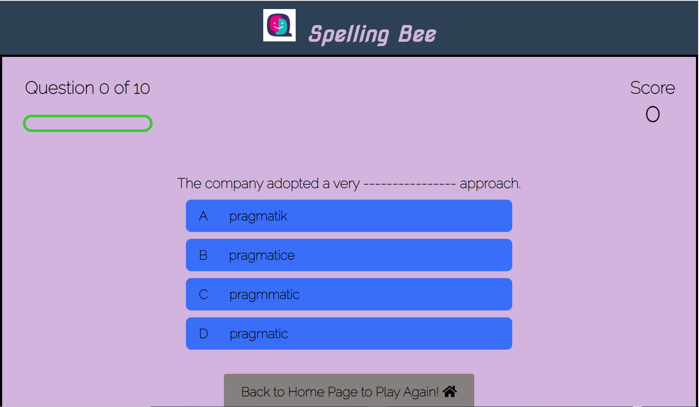
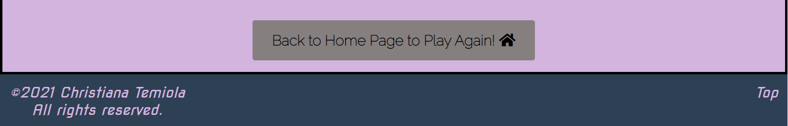

&nbsp; 

# Spelling Bee

Spelling Bee is an online Quiz game that aims at building users vocabulary in order to improve their ability to spell English words.  Users will learn a lot through play since it is a fun game that cuts across all ages, which means that it can be played and enjoyed by all to test how much of their vocabulary they know and if they can spell the words and write them down correctly in order to make a complete sentence. Sometimes, even simple words in English language that we pronounce and use everyday can throw someone off balance when it comes to spelling and writing them down correctly especially for CV and cover letter preparation, formal letter or any where that first impression matters and one's spelling has to be top-notch to prevent your CV from being shoved aside by potential employers due to poor spelling mistakes. 

&nbsp;

&nbsp;

# Features

It is designed to be responsive on all device sizes and thereby accessible on a range of devices. Usability was thought of from the start so the user interface was designed in its simplest form with good colour contrast between the background and text colours respectively. The font-size and weight of the texts are large and bold with all texts aligned to the centre so that it can be easily tweaked/adjusted to fit different screen sizes using the "@media screen css rule".  Also, the buttons for navigating around and for submission are big enough to see.  All these features will ensure that both first time and returning users/visitors to the site find it easy to read the texts, navigate around the interface pretty quickly, interact with the game and have a pleasurable experience while doing so. 

## Existing Features

* Heading Bar

    * It is uniform across all the two pages and consists of the logo and Spelling Bee quiz name nicely placed beside each other and aligned to the centre to keep in line with the overall structure of the page.

    * See the 'Heading Bar' Screenshot below:

    

 &nbsp; 

    The entire user interface is divided into two parts namely:

      i. Home Page

      ii. Quiz Page

* Home Page 

    * This is the page that appears as a user clicks on the url link and lands on the page. It is defined from the rest the of the screen page by a black border with a heading bar at the top. It welcomes the user and aims at making them feel relaxed and tune them in to a playful fun mode while at the same time learning through their interaction with the quiz app. It consists of an input textbox to allow the user input a username which will be used to display a personalised welcome message to the user and a submit button to submit the name input. There is also a play button at the bottom centre of the page which when clicked takes the user to the quiz page in order to play the quiz. 
    For mobile view, most of these features on this page will stack on top of each other for great user experience and responsiveness.

    * See the 'Home Page' Screenshot below:

    
    
    &nbsp; 
    
    
    

&nbsp; 

* Quiz Page

    * This is the page that the user interacts with in order to play the quiz. Like the home page, it is defined from the rest the of the screen page by a black border with a heading bar at the top in order to keep in line with uniformity across the two pages. It consists of 10 questions with each having four options to choose an answer from. Each of the options are displayed inside a button with a default background colour of blue. If a user gets the answer right, the button colour changes to green and a sound that depicts that the answer is correct is made and likewise if a user misses the answer, the button colour changes to red and a sound that depicts that the answer is incorrect is made.
    A user's score is displayed at the top right hand corner of the page while question number tracker is displayed at the top left corner of the page to let the user know which question they are on.
    At the end of play, The feedback message is displayed underneath the score and question tracker area and is nicely centred so it can be clearly seen by the user at the end of the quiz. The aim of this message is to give the user feedback on how they performed by either displaying a congratulatory message or a failure message. The feedback display signifies the end of the quiz and a user can either click on the "back to home page button" on the quiz page to get redirected back to the home page to play again or close the quiz by closing the browser to quit playing.
    For mobile view, most of these features on this page will stack on top of each other for great user experience and responsiveness.

    * See the 'Quiz Page' Screenshot below:

    
    
    &nbsp; 
    
    

 &nbsp; 

 * Footer Bar

    * It is uniform across all the two pages and consists of the copyright symbol with the name of the author to the bottom left of the page and the "Top" button located at the bottom right of the page that easily takes a user back to the top of the page instead of manually using the scroll bar which can be annoying.  

    * See the 'Footer Bar' Screenshot below:

    

 &nbsp; 

 ## Features to Implement in the future

  * For the issue mentioned in the 'Issues Encountered and Not Resolved' section above, I hope to resolve and implement it in the near future.
  
  * Also, I had the plan of making the feedback message appear on a separate page at the end of play rather than on the same page as the question but due to time constraint, I could not so I hope to add this in the near future  

&nbsp; 

How the Quiz Game works (Use Cases):

 It is a multiple choice question whereby a set of ten questions are provided to the user one after the other in which each is an uncomplete sentence and the job of the user is to fill in each of the blank spaces with the correct word (answer), checking out the options provided carefully before selecting their choice as they look the same to trick the user into picking the wrong answer. The score is displayed at the top right corner of the Quiz screen which updates itself as the user goes through the ten questions based on whether the answer is right or wrong.
 At the end of the quiz, it gives a final feedback/verdict in the following way:

 a. If a user scores between 600 and 1,000 inclusive, it  displays the score obtained along with a congratulatory message.
 b. If a user scores between 0 and 500 inclusive, it displays their score likewise along with a message of failure.
 
&nbsp; 

User Experience (UX)

* User stories

    * First Time Visitor Goals

        a) I want to easily understand the main purpose of the site and navigate easily around it.

        b) I want to be able to submit my answer and get response quickly on whether I'm right or wrong.

        c) I want to be able to get a feedback message on how well I performed in the quiz.

        d) I want to be able to return easily to the home page from the quiz page without using the browser back button in order to play again.

        e) I want to be able to go back to the top of the page easily from the bottom without using the scroll bar.

        
    * Returning Visitor Goals

         a) I want to be able to submit my answer and get response quickly on whether I'm right or wrong.

        b) I want to be able to get a feedback message on how well I performed in the quiz.

        c) I want to be able to return easily to the home page from the quiz page without using the browser back button in order to play again.

        d) I want to be able to go back to the top of the page easily from the bottom without using the scroll bar.

    * Design

        * Colour Scheme

            * Background colour of a lighter shade of purple was used with a black border. It blends well into the font colour of black which is predominantly used for texts on every page and grey background colour for the buttons which changes to light purple with a black border on hover.

        *  Typography

            * Google's 'Raleway' and 'Nova Square' typeface was repeatedly used on every page of this website but with variations in sizes and font weights. 
            'Nova Square' is similar to cursive typeface and was chosen because it is modern and stylish in nature which makes it best suited for quiz/game apps. It was used to display the welcome message on the home page and feedback message on the quiz page. 
            Also, 'Raleway' typeface complements 'Nova Square' really well and was used for the rest of the texts across the two pages.

        * Imagery

            * There isn't much images in the quiz except for the logo that was used alongside the name of the quiz game at the top of each page and emojis (both smiley and sad faces) were used with the display of feedback message based on the user's score.

&nbsp;            

# Wireframes

 For prototyping, the wireframes were designed manually by hand without using any automated tool in order to bring this idea to life. The wireframes has evolved over time during the course of development. The wireframes captured how the two pages of the quiz app will look while in different states such as:

  *  Home page before user input screen (for Desktop, Laptop & Tablet) 
  *  Home page after user input screen (for Desktop, Laptop & Tablet) 
  *  Home page before user input screen (for mobile)
  *  Home page after user input screen (for mobile)
  *  Quiz page before user input screen (for Desktop, Laptop & Tablet) 
  *  Quiz page after user input screen (for Desktop, Laptop & Tablet) 
  *  Quiz page before user input screen (for mobile)
  *  Quiz page after user input screen (for mobile)

The initial idea was put on paper and as development proceeded, it was tweaked here and there resulting in the final prototype. This evolvement for large, medum and small screen devices is captured in the wireframes and can be viewed below:

  * Initial Prototypes
    
    
    
    

&nbsp;  

  * Final Prototypes
    
    
    
    
    
    
    
    

&nbsp; 

# Technologies Used

* Languages Used

    * HTML5

    * CSS3

    * JavaScript

&nbsp; 

* Tools Used

    * The prototypes were done manually using pencil, pen and paper to sketch out the idea.

    * Snipping tool to capture screenshots of validator results, website pages and images used in the README file.

    * amIresponsive was used to simulate how responsive the quiz game developed is on desktop, laptop, tablet and smartphones. 

&nbsp; 

* Issues Encountered and Resolved

    * On the Quiz Page, the question tracker was implemented and testing was carried out to ensure that the number updates as a user progresses through the questions but at the end of play, it was dicovered that the question tracker had a bug. It displayed "Question 11 out of 10" instead of "Question 10 out of 10". It took some time to figure out why this is functioning abnormally and almost gave up correcting the error because it was difficult to trace out the source of the issue but through persistence, I finally succeeded in correcting the bug.

    * On the Home Page, I discovered during testing that the form's input text box did not clear away on pressing the submit button but rather it was still displayed alongside the welcome message to the user. I initially though that to correct this should not be an issue but it was so challenging that I ended up spending weeks to sort this out. I checked out so many resources online but all that they recommended which I tried failed until I finally contacted tutor support and just a single line of code sorted the issue out. See the magical code below:
    loginForm.style.display = "none";  

&nbsp; 

* Issues Encountered and Not Resolved

  * At the end of Play, I intended that the feedback message displayed to the user should be personalised with the user's name just like in the home Page's welcome message but it didn't work out. I thought it should be easy to do by replicating the way it was done on the home page but didn't work. I also searched online to look for resources to guide me on how to do this and all the resources I looked at pointed me to using either sessionStorage or localStorage to store the user name. I did that on the home Page and tested it out with console log and it displayed rightly but the issue is that when I wanted to use it on the quiz page by inserting the 'username' variable within the feedback message, it didn't display the username but placed 'null' in its space instead. See code below:
  goodCommendation.innerText = `Congratulations ${username}😊!!! Your Final score is ${score} out of ${totalScoreOfGradePercent}, You are a Pro!`;

&nbsp; 

Frameworks, Libraries and Programs Used

1. Google Fonts

    * Google Font's 'Nova Square' and'Raleway' typefaces were used for the throughout the pages but in different styles and sizes. To use these fonts, the appropriate link provided on the Google font page was copied into the head of the html pages where they were needed and then referred to through the use of "font-family" property before it can be effected on any HTML element.

2. Git

    * Git was used for version control by utilising the Gitpod terminal to commit to Git and push to GitHub.

3. GitHub

    * GitHub was used to store the project's code after being pushed from Git.

4. JPEG Compressor

    * JPEG Compressor was used to resize the logo used on this website.

5. Google Image Search

    * Google Image Search was used to search for appropriate logo used with the header text across the two pages.

6. Wireframes

    * The wireframes for both desktop, laptop, tablets and mobile devices were sketched manually by me using pencil and paper.

## Testing

The W3C Markup Validator and W3C CSS Validator services were used to validate every page of the project to ensure there were no syntax errors in the project and prettier code formatter was used to format the code for proper code indentation.

*  W3C Markup Validator 

    * Home Page Result:

     

    * Quiz Page Result:

     

    
* W3C CSS Validator

    * style.css Result:

     

* JSHint online tool was used to validate the JavaScript code named script.js with only warnings shown. The screenshots of the testing result is shown below:

    *  script.js Result:

     
     
     

&nbsp; 

Testing User Stories from User Experience (UX) Section

* First Time Visitor Goals

    i. As a First Time Visitor, I want to easily understand the main purpose of the site and navigate easily around it. 

        a. The quiz game is designed to be intuitive with no hidden or complex functionality that will be difficult for users to understand. The landing/home Page is not Users are automatically greeted with a clean and easily readable navigation bar to take them to any page of their choice.

        b. Users are presented with a large image of the Olumo Rock which covers the entire width of the page and its aim is to make the user's imagination run wild and attract them to come visit.

        c. Users are given a short introduction of the site and an in-depth history of the rock.

        d. The 'Gallery' page displays various images of the rock taken at different views and their historical importance. It also contains pictures of tourists/visitors to the centre.

        e. Information about the opening times and entry fee are displayed clearly on the home page for every visitor and most especially first time visitors to see.

    ii. As a First Time Visitor, I want to be able to navigate easily throughout the site to find content.

        a. The site was built with flexibility in mind.  This means that width percentages that allows the site to scale up and down easily across different screen sizes and devices were used.

        b. The site was made never to entrap the user.  There is a clean navigation bar at the top of each page and each of the links clearly describes what page the users will end up at when it is clicked.

        c. There is a "Back to top of the Page" button at the bottom of each page so users can easily get back to the top of the page when at the bottom instead of using the scroll bar which can be frustrating to the user.

        d. There is a Google Map link in the "Contact Page" that gives direction to users on how to locate the centre for first time visitors.

    iii. As a First Time Visitor, I want to lok for testimonials to understand what their users think of them and also want to locate their social media links to see their following on social media to determine how trusted and known they are.

        a. The user can scroll to the bottom of any page on the site to locate social media links in the footer.

        b. On the "Contact Us" page, additional ways of getting in touch are provided there. 

* Returning Visitor Goal  

    i. As a Returning Visitor, I want to find out if any important information such as opening hours, enrty fee, parking availability, direction details etc. has been updated.

        a. The user can easily find the information needed on the appropriate page since they are displayed clearly with meaningful headings and captions in order to avoid ambiguity which can lead to confusion or misinformation. 

        b. In addition, the user can go to the 'Contact Us' page to get the tourism board's contact details such as office address, phone number and email address or drop a query in the Query/Feedback section of the page.

    ii. As a Returning Visitor, I want to find the best way to get in touch with the tourist center management on any enquiry or feedback I may have.

        a. The user can make use of the 'Contact Us' link on the navigation bar which can be found at the top of each page for easy access and is clearly highlighted in lime green when the mouse is hovered on it.

        b. When a user clicks on the 'Contact Us' link, it takes him to the contact us page where the contact details of the tourism board i.e christYmet and an enquiry/feedback form are provided so he can choose which one to reach them on. 

        c. The Contact Us page contains the office address, email address and Phone number of the tourism board.
        
        d. The email address is set up to automatically open up the site's email and auto-fill their e-mail address in the "To" section.

    iii. As a Returning Visitor, I want to connect to the site's social media platforms in order to give feedbacks and get up-to-date information about any upcoming events.

        a. The footer section which can be found on every page contains links to the site's social media platforms represented with each social media platform's logo/icon for easy recognition.

        b. Any link that the user clicks will open in a new tab beside this current website for closer proximity in case they need to switch from one tab to the other and to ensure that they are not taken away completely from this website but can get back easily when necessary.

        c. An external link to the Ogun State Government website is provided in the mid-section of the home page where users can find information about the social media platforms for all the various departments under it in which christYmet History Website is one of them.

*  Further Testing

    * The website was tested on Google chrome, Microsoft Edge, Opera and Mozilla firefox browsers for compatibility. 
    
    * Testing was done to ensure that all pages were linked correctly.

    * The website was viewed on a variety of devices such as desktop, laptop, iPad Pro, iPhone 6s and Huawei P smart Z android phone.

    * Friends and family members were asked to review the quiz app and documentation in order to point out any bugs and/or User eXperience (UX) issues. 

# Deployment

* The Project was deployed to GitHub Pages using the following steps:

    * Log in to GitHub and under the "Repositories" section, click on the "test-your-english-quiz" repository to deploy.

    * At the top right of this repository, click on "Settings".

    * Scroll down the "Settings" page to locate the "GitHub Pages" section.

    * Under the "GitHub Pages" section, click on the "check it out here!" link.

    * From the drop-down menu under "Source" section, select the Master Branch and click on the "Save" button.

    * The Page will automatically refresh and then provide the link/url of the deployed project. 
    
    * Right-click on that link and select "Open link in new tab", it will present the live website in a new tab.

View the live project [here](https://eb0ny-april14.github.io/test-your-english-quiz/)      

View the GitHub Repository [here](https://github.com/Eb0nY-April14/test-your-english-quiz)  

&nbsp; 

* Credits

    * Content

        * Both the Home and Quiz Pages were created by me.

        * For the Quiz page, I made use of an online tutorial video from YouTube by Brian Design, putting my own twist to it in order to make it different from the author's finished quiz game app.  The styling and JavaScript code has few similarities and major differences to show that I clearly understood what the author was doing and applied it my own way to the quiz game.   The link to the video tutorial is https://www.youtube.com/watch?v=f4fB9Xg2JEY

    * Media

        * The Logo used for this website was found through Google Search and obtained at https://image.winudf.com/v2/image1/b3JnLmNhbWJyaWRnZWVuZ2xpc2guYnJhdmkucXVpel9pY29uXzE1NTQ5NjExNjRfMDI4/icon.png?w=&fakeurl=1

        * The audio sounds used on the quiz page and how to apply it to my JavaScript file was obtained from this link: https://docs.idew.org/code-trivia-app/advanced/code-mod-examples/sound-add-sound-effects-on-answer-clicks.

        * The font awesome play icon was used on the home page and obtained from the font awesome website while the emojis used on the quiz page for the feedback messages and its corresponding usage tutorial were obtained from the following websites: 

            * https://www.kirupa.com/html5/emoji.htm

            * https://emojipedia.org/

&nbsp; 

* Acknowledgements

    * Cohort Facilitator Kasia for her continuous help and support.

    * My mentor Asandeep for continuous guidance and feedback.

    * Brian Design's tutorial video on YouTube for helpful resources.

&nbsp;  &nbsp;  &nbsp;  &nbsp;  &nbsp;  &nbsp;  &nbsp;  

